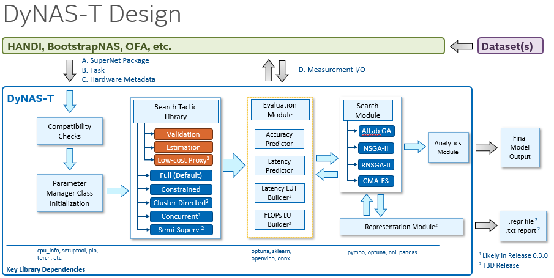

# DyNAS-T

DyNAS-T (**Dy**namic **N**eural **A**rchitecture **S**earch **T**oolkit) is a SuperNet NAS
optimization package designed for finding the optimal Pareto front during neural architure
search while minimizing the number of search validation measurements. It supports
single-/multi-/many-objective problems for a variety of domains supported by the
Intel AI Lab HANDI framework. The system leans heavily on the [pymoo](https://pymoo.org/) 
optimization framework. Unique to DyNAS-T are the following features:
* Automatic handling of supernetwork parameters for search and predictor training
* ConcurrentNAS accelerated search
* Warm-start (transfer) search
* Search population statistical analysis

## Supported SuperNet Frameworks

DyNAS-T is intended to be used with existing standalone SuperNet frameworks suchs as Intel
HANDI, Intel BootstrapNAS, or external libraries such as Hanlab Once-for-All (OFA). 

* HANDI MobileNetV3 (supported)
* HANDI ResNet50 (supported)
* HANDI Transformer (Q4'21)
* BootstrapNAS ResNet50 torchvision (Q4'21)

## Getting Started

To setup DyNAS-T run `pip install -e .` or make a local copy of the `dynast` subfolder in your
local subnetwork repository. 

Examples of setting up DyNAS-T with various SuperNet frameworks are given in the
./examples directory. We suggested using `dynast_mbnv3_full.py` as a starting point
using the HANDI MobileNetV3 supernetwork. 

## Design Overview

DyNAS-T supplements existing SuperNet Training frameworks in the following ways. 

## Requirements

Requirements for using DyNAS-T are given in `requirements.txt`. Key requirements to
be aware of are:  
* pymoo == 0.5.0   
* optuna == 2.4.0   
* scikit-learn == 0.23.2  
* pandas == 1.1.5  

## Release Notes

0.3.0 (current) - Draft:   
* Updated to pymoo version 0.5.0
* Added ConcurrentNAS example for MobileNetV3
* New `ParameterManager` handles tranlation between dictionary, pymoo, and one-hot vector formats

 